# Aplicacion-Web-Museo-Cliente-API

Muchas gracias por haber descargado mi aplicación, esta es la versión de cliente, recuerda que tambien necesitas la versión servidor API para poder desplegar ambas y que esta aplicación cliente reciba los datos del servidor. Si no sabes donde esta busca en el mismo perfil de github que te ha descargado este repositorio, se lla "Aplicacion-Web--Museo".

Una vez tengas los dos repositorios listos vamos a empezar a preparar el de servidor.

1.- Primer paso con el servidor, realizar la instalación de los requirements.txt, para ello nos vamos hasta la carpeta Museo (usando cd) y una vez aquí ejecutamos el comando: pip install -r requirements.txt. Con esto tendremos instalado python.

2.- En la misma carpeta de Museo vamos a crear el enterono virtual con python, para ello ejecutamos el comando: python3 -m venv myvenv en la terminal. Una vez creado podremos activarlo con el comando: source myvenv/bin/activate 
Esto hara que nos aparezca un (myven) al principio de cada línea del terminal, indicando que esta activo.

Como en esta carpeta ya se pasa el mysite configurado no hace falta que se cree.

3.- Arrancamos el servidor, si ejecutamos el comando python manage.py runserver, arrancaremos nuestro servidor, si quisiera arrancarlo por una ruta en concreto se lo especificariamos añadiendosela detras del propio comando, por ejemplo: python manage.py runserver 0.0.0.0:8080. Por defecto la ruta será la 127.0.0.1:8000

4.- Vamos a volver a realizar el pip install -r requirements.txt y al acabar veremos que nos da error si intentamos levantar nuestro servidor, esto se debe a que no tenemos configurado el .env en nuestro servidor, vamos a ello. Nos creamos el archivo en la misma carpeta que Museo y tomamos como referencia el .env.plantilla para saber que debe tener.

Pero tenemos un problema, necesitamos levantar el servidor para poder dar un token de verdad a nuestro servidor, así que hagamos un pequeño apaño, en el archivo .env donde pone "SECRET_KEY=" le pondremos un codigo falso, pondremos literalmetne cualquier cosa, lo mejor una sucesicón de letras aleatorias, esto obviamente no nos será útil en el futuro, pero para salir del paso nos sirve. Si guardamos y corremos nuestro servidor veremos como ahora si que nos deja.

5.- Vemos que tenemos migraciones que no se han aplicado, vamos a hacer que se apliquen usando un comando python manage.py migrate. Bien si ahora volemos a levantar el servidor todo deberia estar bien.

6.- Vamos a gestionar ahora la creacion de un token valido, para ello nos vamos a la pagina de administrador de Django. Para ello accedemos a esta url: http://127.0.0.1:8000/admin 

Veremos que nos sale un formulario de login, podemos hacer dos cosas, crear un super ususario con este comando: python manage.py createsuperuser y usar las credenciales que le hemos dado para acceder o cargar el fixtures de nuestro proyecto que ya incluye un super usuario admin con contraseña admin. Así se hace un loaddata: python manage.py loaddata appmuseo/fixtures/datosmuseo.json esto tambien cargaría todos los demas datos que tenemos para esta aplicacion, algunos datos de modelos, usuarios, grupos y permisos.

7.- Una vez hayamos accedido con un super usuario vamos a configurar el token. Para ello accedemos a esta url: http://127.0.0.1:8000/oauth2/applications/  Puede cambiar dependiendo de en que puerto tengas abierta la aplicación. Una vez accedamos a esta pagina deberemos rellenarla de una forma similar a esta:

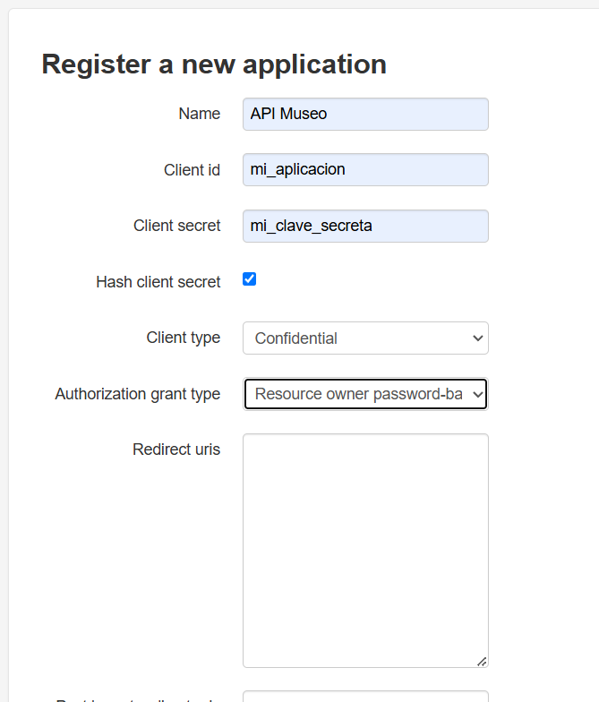

Con esto ya podemos crear el token de acceso que necesitamos, escribimos este comando en la terminal y nos devolvera varios datos, pero el que nos importa es el de acces_token.

curl -X POST "http://0.0.0.0:8000/oauth2/token/" -d "grant_type=password&username=admin&password=admin&client_id=mi_aplicacion&client_secret=mi_clave_secreta"

Y nos devolverá algo como esto: 

{"access_token": "orMCMMA3mh0Ltb1Zj9N2ROv9TKhKdq",
 "expires_in": 36000, 
"token_type": "Bearer",
 "scope": "read write groups", 
"refresh_token": "vgzJdLX2itA7PZ4DVg9ZJMxyp1IJOU"}

Ese access_token es el que pondremos en el SECRET_KEY del .env, ahora siendo algo funcional.

8.- Ahora vamos a hace run paso un poco opcional, pasar los datos básicoas que tengo en el fixtures. Esto solo son datos de los modelos para que se vea algo en ellos, permisos y algunos usuarios, todo esto lo puedes hacer tú desde cero e incluso crear nuevos modelos o cambiar alguno (recuerda hacer el python manage.py makemigrations y el python manage.py migrate si cambias algo de los modelos). 

Si quiers tener los mismos datos que el fixture solo debereas hacer un comando muy simple: python manage.py loaddata appmuseo/fixtures/datosmuseo.json

Vamos ahora con la configuración del cliente

1.- Nos colocamos en la carpeta de MuseoAPI y ejecutamos un pip install -r requirements.txt, después, como en el servidor, creamos el entorno con python3 -m venv myvenv, y podemos activar el entorno con source myvenv/bin/activate. Una vez hecho volvemos a ejecutar el  pip install -r requirements.txt, ahora si se nos instalará todo.

2.- Una vez instalado y con el entorno virtual activo vamos a probar a arrancar el cliente, recuerda debe ser por un puerto distinto al del servidor, por ejemplo si el servidor corre por el puerto 8000 arranca el cliente por el puerto 8001, así: python manage.py runserver 8001

Veremos que tenemos un error, efectivamente, es el .env, tambien debemos configurarlo aqui, por suerte va a ser mucho mas rápido que en el servidor.
Creamos el archivo .env, podemos fijarlos del .env.plantilla para saber que tiene. Una vez lo tengamos le añadimos las siguientes líneas: 

    TOKEN_ACCESO=orMCMMA3mh0Ltb1Zj9N2ROv9TKhKdq

    API_BASE_URL=http://127.0.0.1:8000/api/v1/

El mismo token que estamos usando en el servidor y la ruta para acceder al servidor.

Con esto ya podriamos arrancar sin problema nuestro cliente. Al hacerlo nos damos cuenta de que tenemos migraciones sin aplicar, pues vamos a solucionarlo ejecutando el comando: python manage.py migrate.

Al ejecutarlo y volver a levantar el cliente ya deberia estar todo correcto y si accedemos al enlace de nuestro cliente veremos que podemos consultar los diferetes modelos, registrarnos y logearnos sin problema.

Vamos a analizar que podemos hacer con estos modelos... vamos a realizar las operaciones básicas de consumo de API: GET, POST, PUT, DELETE y PATCH.

El GET es fácil, nada más entrar hemos visto que tenemos un museo creado

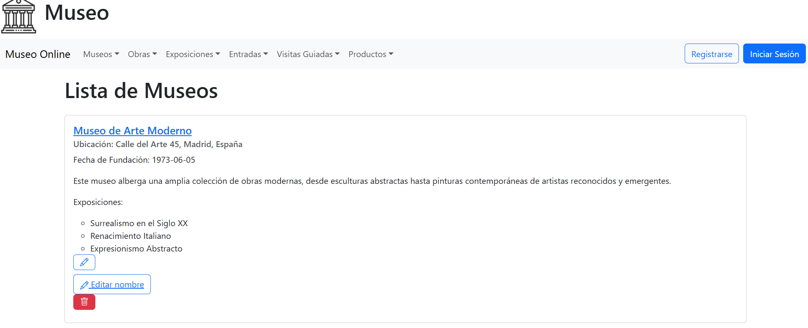

También podemos buscar en Museos, si hacemos clic en el menu donde pone museos se nos abríra un desplegable y podremos darle a buscar, una busqueda simple o avanzada, pero ambas funcionaran y nos devolveran el resultado de la búsqueda.

El POST es más complicado, porque ahora mismo no podriamos hacer ninguno, para ello debemos registrarnos en la aplicación, pulsamos el boton de registrarse y seleccionamos el rol de "Responsable". Debería quedarnos algo así:

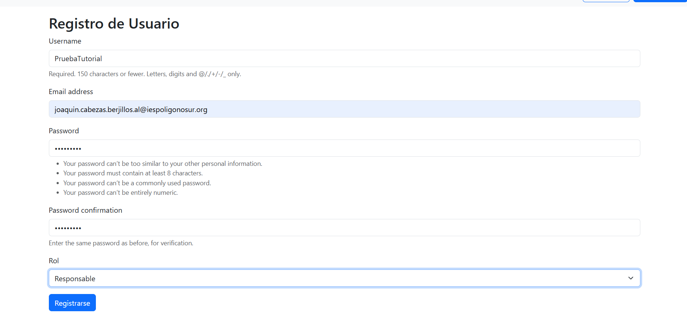

Este rol es importante porque es el que nos dejará realizar el resto de operaciones.

Sigamos con el POST si vamos a la pestaña de Museo, le damos a Crear Museo, rellenamos los campos...

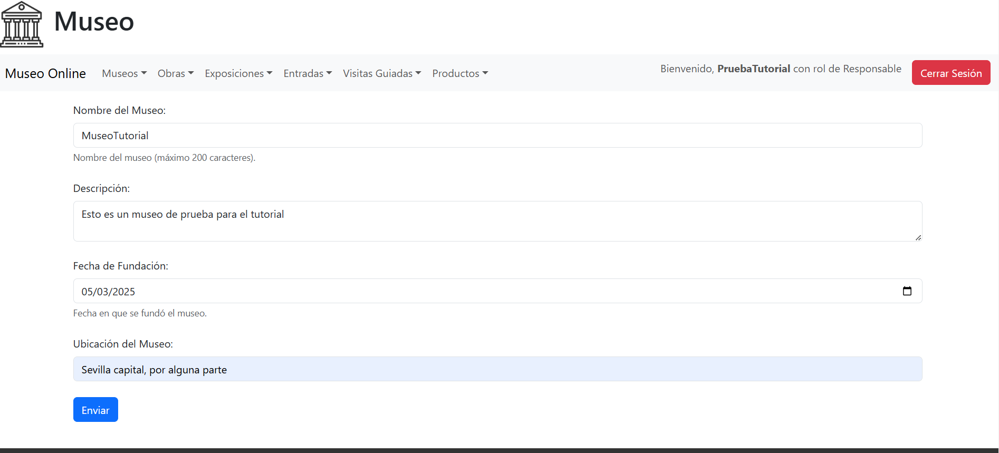

Y al darle a crear veremos que lo tenemos en la lista de Museos, repasamos el GET así.

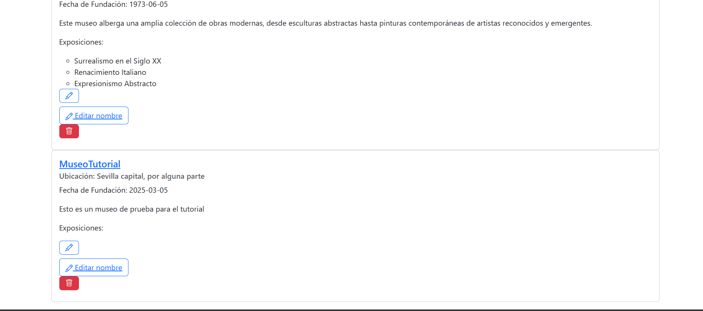

Perfecto, vayamos ahora con el PUT, vamos a cambiar varios campos de este museo, es facil, solo debemos darle al primer icono azul del lápiz, veremos que es como el formulario de creación pero con todos los campos rellenos. Vamos a cambiarlos.

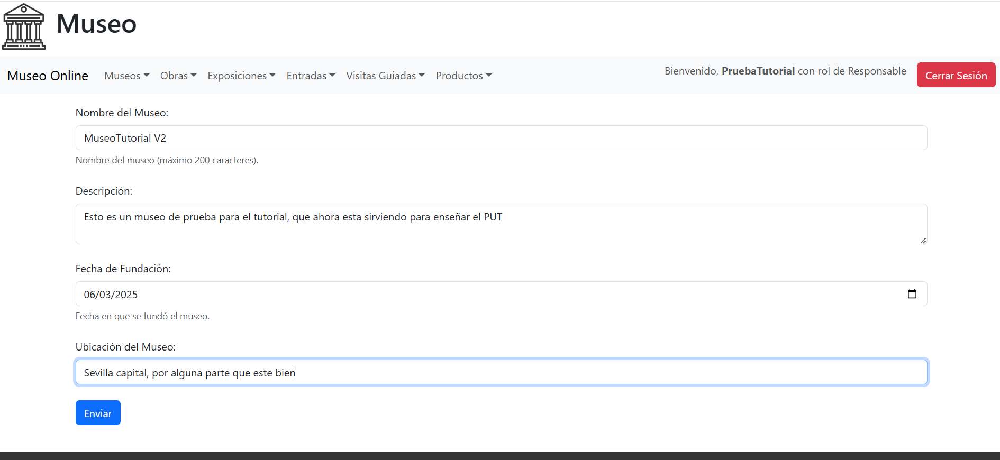

Si le damos a enviar, nos volvera a mandar a la lista de museos y podremos comprobarlos cambios.

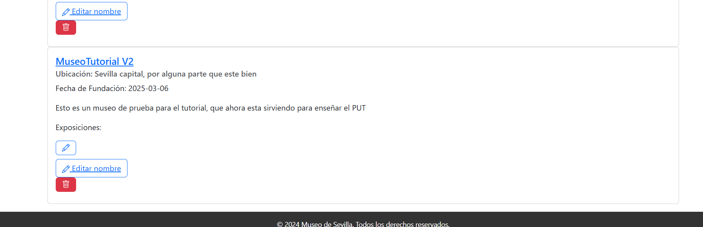

Pasemos ahora a un método muy parecido al PUT, el PATCH, que es un PUT pero que solo afecta a un único campo, en este caso al nombre, vamos a editar el nombre del museo. Para ello le damos clic al segundo icono del lápiz que pone "Editar nombre". Esta vez vemos que solo nos aparece un único campo ya relleno, que es el nombre. Vamos a cambiarlo.

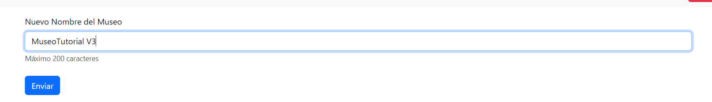

Y vemos que se ha aplicado bien

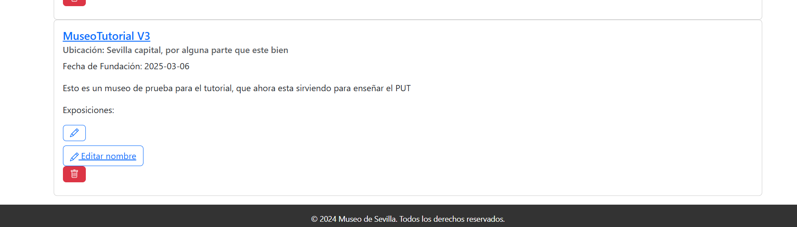

Bien ya hemos llegado al último el DELETE, este es bastante fácil, solo debemos darle al botón rojo, con un icono de papelera. Al darle nos saldra un mensaje de confirmación. 

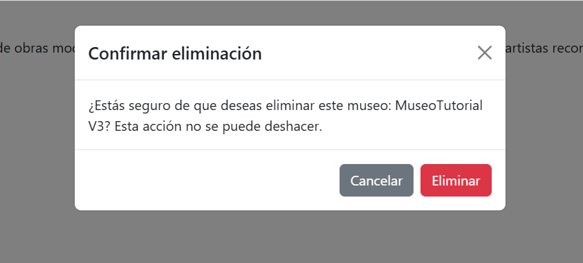

Si le damos a que sí, nos devolvera a la lista de museos, pero esta vez, el que acabamos de crear ya no estará, porque ha sido eliminado.

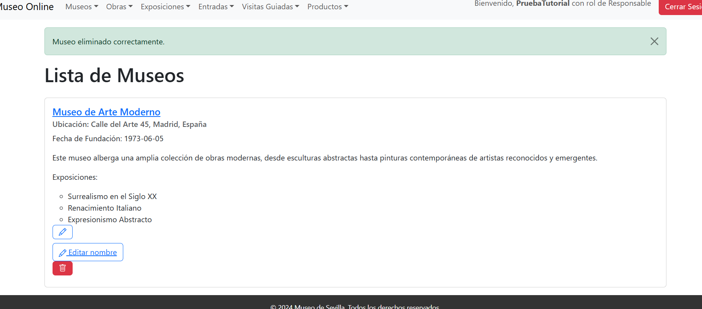

Y con esto ya tendriamos claro que hacer para que nuestro cliente funcione consumiendo los datos del servidor y hemos repasado los métodos GET, POST, PUT, DELETE y PATCH que puede realizar el cliente. Espero que haya quedado todo claro. Muchas gracias otra vez por descargar este repositorio y espero que te sirva para aprender.

# 📜 Gestión de Permisos en la API

Este documento detalla los permisos de acceso para cada tipo de usuario en la API del Museo.

## 👤 Tipos de usuarios
- **Público (No autenticado):** No ha iniciado sesión.
- **Visitante:** Usuario registrado con acceso a entradas y visitas guiadas.
- **Responsable:** Usuario con permisos avanzados para gestionar museos y otros elementos.

## 🔓 Permisos de acceso

### 📌 Museos
| Acción               | Público (No autenticado) | Visitante | Responsable |
|----------------------|------------------------|-----------|------------|
| Ver lista de Museos | ✅ Sí                   | ✅ Sí      | ✅ Sí       |
| Buscar Museos       | ✅ Sí                   | ✅ Sí      | ✅ Sí       |
| Crear un Museo      | ❌ No                   | ❌ No      | ✅ Sí       |
| Editar un Museo     | ❌ No                   | ❌ No      | ✅ Sí       |
| Eliminar un Museo   | ❌ No                   | ❌ No      | ✅ Sí       |

### 📌 Exposiciones
| Acción                   | Público (No autenticado) | Visitante | Responsable |
|--------------------------|------------------------|-----------|------------|
| Ver lista de Exposiciones | ✅ Sí                  | ✅ Sí      | ✅ Sí       |
| Buscar Exposiciones      | ✅ Sí                  | ✅ Sí      | ✅ Sí       |
| Crear una Exposición     | ❌ No                  | ❌ No      | ✅ Sí       |
| Editar una Exposición    | ❌ No                  | ❌ No      | ✅ Sí       |
| Eliminar una Exposición  | ❌ No                  | ❌ No      | ✅ Sí       |

### 📌 Obras de arte
| Acción            | Público (No autenticado) | Visitante | Responsable |
|-------------------|------------------------|-----------|------------|
| Ver lista de Obras | ✅ Sí                  | ✅ Sí      | ✅ Sí       |
| Crear una Obra    | ❌ No                  | ❌ No      | ✅ Sí       |
| Editar una Obra   | ❌ No                  | ❌ No      | ✅ Sí       |
| Eliminar una Obra | ❌ No                  | ❌ No      | ✅ Sí       |

### 📌 Artistas
| Acción            | Público (No autenticado) | Visitante | Responsable |
|-------------------|------------------------|-----------|------------|
| Ver lista de Artistas | ✅ Sí               | ✅ Sí      | ✅ Sí       |
| Crear un Artista  | ❌ No                  | ❌ No      | ✅ Sí       |
| Editar un Artista | ❌ No                  | ❌ No      | ✅ Sí       |
| Eliminar un Artista | ❌ No                | ❌ No      | ✅ Sí       |

### 📌 Tienda y productos
| Acción               | Público (No autenticado) | Visitante | Responsable |
|----------------------|------------------------|-----------|------------|
| Ver lista de productos | ✅ Sí               | ✅ Sí      | ✅ Sí       |
| Crear un Producto   | ❌ No                  | ❌ No      | ✅ Sí       |
| Editar un Producto  | ❌ No                  | ❌ No      | ✅ Sí       |
| Eliminar un Producto | ❌ No                 | ❌ No      | ✅ Sí       |
| Crear una Tienda    | ❌ No                  | ❌ No      | ✅ Sí       |
| Editar una Tienda   | ❌ No                  | ❌ No      | ✅ Sí       |
| Eliminar una Tienda | ❌ No                  | ❌ No      | ✅ Sí       |

### 📌 Entradas y visitas guiadas
| Acción                  | Público (No autenticado) | Visitante | Responsable |
|-------------------------|------------------------|-----------|------------|
| Comprar una Entrada     | ❌ No                  | ✅ Sí      | ✅ Sí       |
| Ver mis Entradas        | ❌ No                  | ✅ Sí      | ✅ Sí       |
| Editar una Entrada      | ❌ No                  | ✅ Sí      | ✅ Sí       |
| Eliminar una Entrada    | ❌ No                  | ✅ Sí      | ✅ Sí       |
| Reservar una Visita Guiada | ❌ No               | ✅ Sí      | ✅ Sí       |
| Editar una Visita Guiada | ❌ No                | ✅ Sí      | ✅ Sí       |
| Eliminar una Visita Guiada | ❌ No              | ✅ Sí      | ✅ Sí       |

### 📌 Guías de visitas
| Acción            | Público (No autenticado) | Visitante | Responsable |
|-------------------|------------------------|-----------|------------|
| Crear un Guía    | ❌ No                   | ❌ No      | ✅ Sí       |
| Editar un Guía   | ❌ No                   | ❌ No      | ✅ Sí       |
| Eliminar un Guía | ❌ No                   | ❌ No      | ✅ Sí       |
